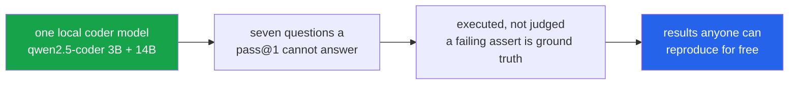

<h1 align="center">code-llm-lab (Python · MBPP/HumanEval · Ollama · mutation testing)</h1>
<p align="center"><i>Seven things worth measuring about a local coder model, none of them its benchmark score</i></p>

<p align="center">
  <a href="#the-through-line">The through-line</a> &middot;
  <a href="#projects">Projects</a> &middot;
  <a href="#reproducibility">Reproducibility</a> &middot;
  <a href="#quick-start">Quick start</a> &middot;
  <a href="#tests">Tests</a> &middot;
  <a href="#what-this-repo-does-not-do">What it does NOT do</a> &middot;
  <a href="#problems-hit-while-building-this">Problems hit</a>
</p>

<p align="center">
  <a href="https://github.com/hammasbuilds/code-llm-lab/actions/workflows/ci.yml"></a>
  
  
  
  
  <a href="LICENSE"></a>
</p>

---

## The through-line



A pass@1 number tells you almost nothing you can act on. These seven ask questions that
change what you would actually build: whether the bigger model is worth its VRAM, when to
stop a self-debug loop, whether generated tests catch anything, and how much of a published
score is the prompt rather than the model.

Everything runs locally against Ollama. No API key, no hosted call, no cost — which is the
point. **A result nobody can reproduce without a billing account is a result nobody checks.**

Two pairs corroborate each other from opposite directions, which is the part worth trusting.
**02 and 04** both say first-attempt failures are things the model cannot do, not things it
is one nudge from — reached once by looping five times on test feedback and once by pitting
repair against rewrite. **03 and 07** both say MBPP's task *descriptions* are the weak link,
reached once through test suites and once through docstrings.

> **What you get on the first attempt is very nearly all you get — and a good part of what
> you get is the prompt rather than the model.**

## Projects

| | Project | Tasks | The finding |
|---|---|---:|---|
| 01 | [Where a 5x bigger model actually pays](projects/01_coder_size_curve/) | 250 | Of the 198 tasks either size can solve, the 3B already handles **75.8%**. The 14B's entire advantage is 48 tasks — and it *loses* 8 the 3B gets right, which bounds how much of the 16-point gap is signal. |
| 02 | [How many self-debug rounds are worth paying for](projects/02_self_debug_ceiling/) | 150 | Rounds 1–2 captured **100%** of everything the loop ever achieved. Rounds 3–5 added nothing at all, for 60% of the compute. |
| 03 | [Do model-written tests catch anything](projects/03_tests_that_kill/) | 150 | From the implementation, generated suites kill **93.4%** of mutants against MBPP's own 85.0%. From the task description, only **16%** of suites even agree with the reference — a measurement of the spec, not the model. |
| 04 | [Repair the failure, or throw it away](projects/04_repair_vs_rewrite/) | 250 | **93.3%** of first-attempt failures survive both strategies. The gap between 1 and 3 out of 60 is two numbers inside the noise, and reporting it as a result would be wrong. |
| 05 | [The same task, asked five ways](projects/05_prompt_shape_variance/) | 200 | **24%** of tasks are solved under one phrasing and failed under another. The 7.5-point spread looks like noise you could average away; the flip rate says the per-task signal is much weaker than any single score suggests. |
| 06 | [The temperature you benchmark at is not the one you deploy at](projects/06_temperature_pass_at_k/) | 60 | The ordering flips: T=0 wins pass@1, T=0.7 wins pass@5 by **5 points**. Benchmark at T=0, deploy an agent that samples five times, and you leave that unclaimed. |
| 07 | [Code → prose → code](projects/07_docstring_roundtrip/) | 200 | The roundtrip beats MBPP's own task description by **32.5 points** — the opposite of the expected direction, because the description was written with the answer in view. It is a leak, not a spec. |

All seven are built. **Every number above came out of a run on this machine**, and each is
mirrored in that project's `results.json` alongside the model, sample size, temperature and
seeds that produced it.

### 01 · Where does a 5x bigger model actually pay? — 250 tasks

qwen2.5-coder at 3B and 14B — same family, same recipe, so the comparison is clean.

```
3B  pass@1 : 60.0%
14B pass@1 : 76.0%

both         142   56.8%   the 14B bought nothing here
big_only      48   19.2%   this is what the size is for
small_only     8    3.2%   the 14B loses these
neither       52   20.8%
```

**Of the 198 tasks either size can solve, the 3B already handles 75.8%.** The 14B's entire
advantage is 48 tasks — and it *loses* 8 the 3B gets right, which bounds how much of the
16-point gap is signal rather than noise.

If your workload looks like MBPP, the question is not "which model is better" but "is 19.2%
of tasks worth 5x the weights", and the answer depends on what those 48 tasks are worth to
you. The aggregate score cannot tell you that.

- **Stack:** Ollama, `qwen2.5-coder:3b` and `:14b`, MBPP
- **In:** a task and a model size
- **Out:** pass@1 for each size **and the four-way bucket split** — which is the part an
  aggregate score destroys, because `both` and `neither` cancel out of the difference

### 02 · How many rounds of self-debugging are worth paying for? — 150 tasks

Give the model its failing test output and let it try again, up to five times. Unlike a
revision loop judged by another model, a failing assert is ground truth.

```
round 1: +117 solved   cumulative 78.0%
round 2:   +1 solved   cumulative 78.7%
round 3:   +0
round 4:   +0
round 5:   +0
```

**Rounds 1–2 captured 100% of everything the loop ever achieved. Rounds 3–5 added nothing
at all, for 60% of the compute.**

The 32 tasks still failing after round 1 were, with one exception, not tasks the model was
one nudge away from solving. They were tasks it could not do, and showing it the error five
times did not change that. Every agent looping five times on test feedback is paying five
times the tokens for the value of two.

- **Stack:** Ollama, `qwen2.5-coder:14b`, MBPP
- **In:** a task, and on every round after the first, the model's own code plus the real
  test output it produced
- **Out:** newly solved per round, so a plateau is visible as a shape rather than inferred
  from a final total. Each round is seeded separately, or the cache would hand back round
  one's answer and the flat curve would be an artefact

### 03 · Do model-written tests catch anything? — 150 tasks

"Write tests for this" judged by mutation kill rate rather than coverage — a test that
calls every line and asserts nothing has 100% coverage and catches nothing.

```
                    valid   scored   asserts   kill rate
from_description    16.0%       19      12.1       88.9%
from_code           40.7%       48      11.0       93.4%
```

Two different findings here.

**Working from the task description, only 16% of suites even agree with the reference.**
Not because the tests are bad — because the sentence does not say whether the function
returns a list or a tuple, or what empty input does, and the model has to guess. That is a
measurement of the spec, not of the model.

**Working from the implementation, the tests are good.** On the suites that are valid:

```
model-written kill rate : 93.4%
MBPP's own kill rate    : 85.0%
difference              : +8.5%
```

The model wrote 3.7x as many asserts as MBPP ships and caught 8.5 points more of the
mutations. Generated tests are better than this benchmark's own — which says as much about
three-assert benchmarks as it does about the model. See
[mbpp-false-accepts](https://github.com/hammasbuilds/mbpp-false-accepts) for how thin three
asserts are.

- **Stack:** Ollama, `qwen2.5-coder:14b`, MBPP, stdlib `ast` for mutation
- **In:** a task description *or* the reference implementation — the two arms
- **Out:** kill rate against 8 single-point mutants per task, scored **against MBPP's own
  suite on the same mutants**, so the comparison is like for like

### 04 · Repair the failure, or throw it away and start over? — 250 tasks

Agents almost always patch. The alternative — discard it and regenerate from the task — is
rarely tried and almost never compared. Both arms start from the same failed attempt and
get exactly one more call. 60 first-attempt failures.

```
repair  fixed :  1  ( 1.7%)
rewrite fixed :  3  ( 5.0%)
neither       : 56  (93.3%)
```

**Neither works.** 93.3% of the failures survive both strategies. The gap between 1 and 3
out of 60 is not a result — it is two numbers inside the noise, and reporting "rewrite beats
repair by 3.3 points" from them would be wrong.

The real finding is the 93.3%, and it agrees with project 02 from a different direction:
the tasks a model fails on its first attempt are mostly tasks it *cannot do*, not tasks it
is one nudge away from. Retry strategies are a rounding error on MBPP. **What you get on
the first attempt is very nearly all you get.**

That is worth knowing before building an agent architecture around a retry loop.

- **Stack:** Ollama, `qwen2.5-coder:14b`, MBPP
- **In:** one failed attempt, and a strategy — patch it, or bin it and start again
- **Out:** both arms on the same 60 failures, under **different seeds**, or the cache would
  serve the rewrite arm the repair arm's generation and the comparison would be vacuous

### 05 · The same task, asked five ways — 200 tasks

Five phrasings carrying identical information. Same model, same temperature, same tasks,
same execution rule — the only variable is wording.

```
plain       78.5%
docstring   75.5%
comment     74.5%
signature   74.5%
terse       71.0%

spread       7.5%   attributable to formatting alone
```

7.5 points is worth knowing, but the sharper number is underneath it:

```
solved by at least one phrasing : 168  (84.0%)
solved by every phrasing        : 120  (60.0%)
flipped on phrasing alone       :  48  (24.0%)
```

**Just under a quarter of tasks are solved under one wording and failed under another.**
For those 48 the benchmark is not measuring whether the model can write the function. It is
measuring which sentence it was handed.

The aggregate hides this completely. A 7.5-point spread looks like noise you could average
away; a 24% flip rate means the per-task signal is much weaker than any single score
suggests, and that two papers reporting 74% and 78% on this benchmark may not disagree about
the model at all.

This is the input half of a pair.
[code-eval-harness](https://github.com/hammasbuilds/code-eval-harness) measured the output
half: identical generations score 0% or 94% depending only on how code is extracted from the
response. Between them they bracket how much of a published pass@1 belongs to the harness
rather than the model.

- **Stack:** Ollama, `qwen2.5-coder:14b`, MBPP
- **In:** one task, rendered five ways — plain, docstring, comment, signature, terse
- **Out:** pass@1 per shape **and the per-task flip set**, because the spread and the flip
  rate are different claims and only the second one bounds the per-task signal

### 06 · The temperature you benchmark at is not the one you should deploy at — 60 tasks

5 samples each, scored with the unbiased pass@k estimator `1 - C(n-c,k)/C(n,k)`.

```
temp    pass@1   pass@2   pass@5   distinct/5
0.0      85.0%    85.0%    85.0%      1.0
0.4      83.3%    84.8%    85.0%      2.2
0.7      84.0%    87.5%    90.0%      3.0
1.0      84.7%    88.2%    90.0%      3.3
```

**The ordering flips. T=0 wins pass@1; T=0.7 wins pass@5 by five points.**

The `distinct` column is the mechanism, not a footnote. At temperature 0 all five samples
are the same string — so pass@5 *cannot* exceed pass@1, however large k gets, and the first
row shows three identical numbers. Raising temperature buys diversity, which pass@k rewards
and pass@1 mildly punishes.

The practical cost: **benchmark at T=0, deploy an agent that samples five times, and you
leave 5 points of achievable pass@5 unclaimed.** Going the other way is cheap — T=0.7 costs
only 1 point at k=1. The asymmetry matters: if you are unsure which regime you are in, the
higher temperature loses you much less than the lower one.

What this does not establish: 60 tasks and 5 samples is a small sweep, and 0.7 versus 1.0
at pass@5 is a tie here (90.0% both). The flip between k=1 and k=5 is the robust part; the
exact optimum is not.

- **Stack:** Ollama, `qwen2.5-coder:14b`, MBPP
- **In:** a task, a temperature, and 5 draws
- **Out:** pass@1/2/5 by the unbiased estimator, **with distinct-sample count beside it** —
  the naive "any of k passed" is biased upward and shifts with n, which makes numbers from
  different papers incomparable

### 07 · Code → prose → code. What survives the roundtrip? — 200 tasks

Ask the model to describe the reference solution, hand that description to a fresh context,
and ask it to implement the function. Compare against implementing from MBPP's own task
description.

```
from MBPP's description    : 48.0%
from the model's own prose : 80.5%
drift                      : +32.5%
```

**The roundtrip is 32.5 points better**, which is the opposite of the expected direction —
information is supposed to be lost, not gained. 73 tasks (36.5%) are solved from the
code-derived description and not from MBPP's; only 8 (4.0%) go the other way.

The explanation is not that the model writes good documentation. It is that **the
description was written with the answer in view.** It is a leak, not a spec. MBPP's
descriptions average 78 characters; the model's average 445, and those extra characters
encode decisions — return type, edge-case behaviour — that the task sentence never made.

That is the same finding project 03 reached from the other side: only 16% of test suites
written from MBPP's descriptions agree with the reference, because the descriptions do not
say what the function should return. Two independent measurements point at the task
descriptions as the weak link, not the model.

The practical version: **a docstring generated from an implementation cannot be used to
evaluate that implementation.** It is downstream of the code, so it agrees with it by
construction.

- **Stack:** Ollama, `qwen2.5-coder:14b`, MBPP
- **In:** either MBPP's task sentence or the model's own description of the reference
- **Out:** pass@1 per arm, plus the **gained and lost task sets** — the direction of the
  drift is the finding, and a single drift number cannot show it

## Reproducibility

Every `results.json` carries the configuration that produced it:

```json
{
  "models": ["qwen2.5-coder:3b", "qwen2.5-coder:14b"],
  "benchmark": "mbpp",
  "temperature": 0.0,
  "samples": 1,
  "seeds": null,
  "n": 250,
  "python": "3.11",
  "commit": "pre-provenance",
  "run_at": "2026-09-20 07:51:54"
}
```

A number with none of that attached is not a measurement. The suite asserts the block is
present and that **no committed result reports fewer than 50 tasks**, because a smoke test
writes the same filename as a real run and an `n=4` result was committed once with nothing
to catch it.

The tests also check the arithmetic each headline rests on — 01's buckets are disjoint and
reproduce both pass@1 figures, 06's pass@k rises with k and is flat at T=0, 07's drift
equals gained minus lost. A results file that contradicts itself means a published claim is
wrong, and that now fails the build.

## Quick start

```bash
git clone https://github.com/hammasbuilds/code-llm-lab
cd code-llm-lab

uv sync --all-groups
ollama pull qwen2.5-coder:14b
ollama pull qwen2.5-coder:3b        # project 01 only

uv run pytest -q                                            # 59 tests, no GPU needed
python projects/01_coder_size_curve/run.py --limit 250       # reproduces the numbers above
```

MBPP and HumanEval load from the local Hugging Face cache; nothing downloads at runtime.

## Layout

```
shared/
  datasets.py        MBPP and HumanEval normalised into one task shape
  execute.py         subprocess with a timeout; pass / fail / error / timeout kept apart
  model.py           Ollama over HTTP, with an on-disk generation cache
  provenance.py      the config block every results.json carries
projects/
  01_coder_size_curve/      run.py · results_mbpp.json · README.md
  02_self_debug_ceiling/    run.py · results_mbpp.json · README.md
  03_tests_that_kill/       run.py · results.json      · README.md
  04_repair_vs_rewrite/     run.py · results.json      · README.md
  05_prompt_shape_variance/ run.py · results.json      · README.md
  06_temperature_pass_at_k/ run.py · results.json      · README.md
  07_docstring_roundtrip/   run.py · results.json      · README.md
tests/
  _loader.py         imports each run.py under a distinct module name
  test_shared.py     the shared layer
  test_projects.py   per-project logic, and the invariants each headline rests on
```

Three decisions that matter more than they look:

**Generation is batched.** One request at a time left the GPU at 9% utilisation — it spends
almost all of its time waiting for the next HTTP round trip rather than decoding. Eight
concurrent requests take it to ~98% and roughly halve wall-clock time.

**Generations are cached** by `(model, prompt, temperature, seed)`. Project 04's first
attempt completed in 3 seconds because project 01 had already asked those exact questions.
The seed is in the key on purpose — see projects 02 and 04, where two arms must not collide.

**`fail` and `error` are not merged.** Both mean the tests rejected the code, but only
`fail` means the tests actually tested something — a candidate caught by crashing would
have survived behind a guard clause.

## Requirements

Python 3.11+, `uv`, and Ollama running locally. A GPU is not required to run the tests —
only to reproduce the measurements. These numbers were produced on a Quadro RTX 5000 (16 GB).

## Tests

```bash
uv run pytest -q          # 59
```

The suite asserts *numerical* behaviour, not just that the code runs: the pass@k estimator
against its closed form, the assert filter dropping a bracket-truncated line without taking
the whole suite down with it, and every project's committed result against the arithmetic
its headline depends on. Nothing here needs a GPU or a running Ollama, so CI runs all of it
on every push.

## What this repo does NOT do

- **It does not test hosted models.** Every number is a local model on one machine.
- **One model family, one size pair, one GPU.** Nothing here says how any of it scales.
- **MBPP is mostly short functions.** The self-debug ceiling in particular may look
  different on tasks where the first attempt is closer to right.
- **Temperature 0 throughout**, except project 06, which is about temperature.
- **Sample sizes are 60–250 tasks**, chosen to fit an overnight GPU window. Large enough to
  separate the effects reported, not large enough for small differences — which is why
  project 04 reports the 93.3% and not the 1-versus-3.
- **It contains seven projects, and that is the whole set.** The related work lives in
  separate repos: [mbpp-false-accepts](https://github.com/hammasbuilds/mbpp-false-accepts),
  [code-eval-harness](https://github.com/hammasbuilds/code-eval-harness),
  [swebench-localization](https://github.com/hammasbuilds/swebench-localization).

## Problems hit while building this

- **The GPU sat at 9%.** Generation was one HTTP request at a time, so the card spent almost
  all of its time waiting rather than decoding. Eight concurrent requests took it to ~98%.
- **Project 03 produced nothing, twice.** First the generated asserts were truncated
  mid-bracket and `ast.parse` rejected the whole suite, dropping every task from the sample.
  Then the description-derived tests genuinely did not match the reference — which turned out
  to be the finding, and the project was restructured into two arms to report it.
- **An `n=4` smoke test was committed** under the same filename a real result uses, and
  nothing caught it. The gate that was supposed to catch it only checked the file existed.
- **The test helper would have tested the wrong file.** It put a project directory on
  `sys.path` and imported the bare name `run`; `sys.modules` is keyed by name, so a second
  project imported that way returns the first project's module and the test still passes.
- **Path resolution read 22.2% where the full path read 96.1%** in a sibling repo — a
  non-monotonic result that turned out to be a scoring artefact, not a finding.

## Keywords

code LLM evaluation &middot; MBPP &middot; HumanEval &middot; pass@k &middot; mutation testing &middot; self-debugging &middot; self-repair &middot; prompt sensitivity &middot; temperature sweep &middot; local LLM &middot; Ollama &middot; qwen2.5-coder &middot; reproducible evaluation &middot; no API key &middot; benchmark methodology &middot; test generation &middot; docstring generation

## License

MIT — see [LICENSE](LICENSE).
