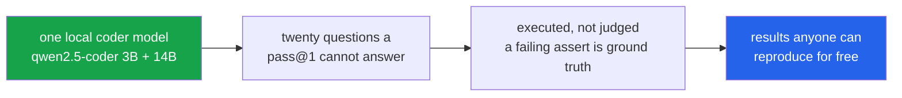

<h1 align="center">code-llm-lab (Python · MBPP/HumanEval · Ollama · mutation testing)</h1>
<p align="center"><i>Twenty things worth measuring about a local coder model, none of them its benchmark score</i></p>

<p align="center">
  <a href="#the-through-line">The through-line</a> &middot;
  <a href="#projects">Projects</a> &middot;
  <a href="docs/FINDINGS.md">Findings in full</a> &middot;
  <a href="#reproducibility">Reproducibility</a> &middot;
  <a href="#quick-start">Quick start</a> &middot;
  <a href="#tests">Tests</a> &middot;
  <a href="#what-this-repo-does-not-do">What it does NOT do</a> &middot;
  <a href="#problems-hit-while-building-this">Problems hit</a>
</p>

<p align="center">
  <a href="https://github.com/hammasbuilds/code-llm-lab/actions/workflows/ci.yml"></a>
  
  
  
  
  <a href="LICENSE"></a>
</p>

---

## The through-line



A pass@1 number tells you almost nothing you can act on. These twenty ask questions that
change what you would actually build: whether the bigger model is worth its VRAM, when to
stop a self-debug loop, whether generated tests catch anything, and how much of a published
score is the prompt rather than the model.

Everything runs locally against Ollama. No API key, no hosted call, no cost — which is the
point. **A result nobody can reproduce without a billing account is a result nobody checks.**

Two pairs corroborate each other from opposite directions, which is the part worth trusting.
**02 and 04** both say first-attempt failures are things the model cannot do, not things it
is one nudge from — reached once by looping five times on test feedback and once by pitting
repair against rewrite. **03 and 07** both say MBPP's task *descriptions* are the weak link,
reached once through test suites and once through docstrings.

> **Both halves of that pair were re-measured, and both survived.** Each was handed the
> string `AssertionError` in place of an error message (see
> [Problems hit](#problems-hit-while-building-this)), which handicaps only the arms that
> *read* feedback — so "feedback does not help" is exactly what the bug would manufacture,
> and neither number could be trusted until it was re-run. **04**: conclusion holds at
> p=0.43, though its repair arm gained 9 fixes while rewrite returned the identical 21 tasks.
> **02**: the plateau is unchanged, rounds 1–2 still capturing 99.3%. The ceiling is real
> and is not made of missing error messages. The same bug did *not* spare
> [13](projects/13_feedback_content/), which reversed outright — which is what makes the two
> that survived worth believing.

> **What you get on the first attempt is very nearly all you get — and a good part of what
> you get is the prompt rather than the model.**

## A caveat that applies to every MBPP row below

MBPP ships an official split by `task_id` (Austin et al. 2021): **11–510 is test**, 511–600
validation, and **601–974 is training data** — public since 2021, and therefore in the
pretraining corpus of any model trained on public code. These projects ran on all 974.

That is not a neutral choice. Measured on the same cached generations:

| split | n | qwen2.5-coder:3b | qwen2.5-coder:14b |
|---|---:|---:|---:|
| **test** (held out) | 500 | 60.6% | **76.8%** |
| **train** (public since 2021) | 372 | 65.3% | **85.2%** |
| gap | | +4.7 (p=0.15) | **+8.4 (p=0.002)** |

**The 14B is 8.4 points better on MBPP's training split than on its test split**, 95% CI
+3.2 to +13.6. The 3B shows a smaller gap that does not reach significance. A gap that grows
with model size is what memorisation looks like: the larger model has absorbed more of the
same public corpus.

Two consequences, stated rather than buried:

- **The headline pass@1 of 80.3% is inflated.** On the held-out 500 it is **76.8%**, and
  that is the number comparable to published MBPP results. Anything quoting all 974 —
  including every table below — is measuring partly on training data.
- **The measured size advantage shrinks on clean data**, from +19.9 points on the train
  split to **+16.2** on the test split. Project 01's finding survives; its magnitude was
  overstated by about a fifth.

Not everything moves. Project 01's *regression* rate — tasks the 3B gets right and the 14B
gets wrong — reads 3.6% on test, 3.2% on train and 3.7% overall, so that finding is
independent of contamination.

`load("mbpp", split="test")` now exists for this. The default stays `all` so existing
results remain reproducible, and each project states which it used. HumanEval has no
splits — all 164 problems are held out — which is part of why it is the cleaner comparison.

## Projects

| | Project | Tasks | The finding |
|---|---|---:|---|
| [**01**](projects/01_coder_size_curve/) | [**Where a 5x bigger model actually pays**](projects/01_coder_size_curve/) | 972 | Of the 817 tasks either size can solve, the 3B already handles **74.8%**, and the 14B *loses* 36 it gets right (**3.7%**, stable across splits). On MBPP's **held-out 500** the size advantage is **+16.2 points**, not the +17.5 the full corpus reports — see the contamination caveat above. |
| [**02**](projects/02_self_debug_ceiling/) | [**How many self-debug rounds are worth paying for**](projects/02_self_debug_ceiling/) | 500 | Rounds 1–2 capture **99.3%** of everything the loop achieves; rounds 3–5 add 3 tasks for 60% of the compute. **Re-measured with a real traceback** after the `AssertionError` bug — the plateau is unchanged, so the ceiling is real and not made of missing error messages. |
| [**03**](projects/03_tests_that_kill/) | [**Do model-written tests catch anything**](projects/03_tests_that_kill/) | 500 | From the implementation, generated suites kill **93.8%** of mutants against MBPP's own **85.5%** — +8.3 points on 164 suites and 723 mutants, with 3.5× the asserts. From the task description only **16.6%** of suites even agree with the reference: a measurement of the spec, not the model. |
| [**04**](projects/04_repair_vs_rewrite/) | [**Repair the failure, or throw it away**](projects/04_repair_vs_rewrite/) | 972 | **77.0%** of first-attempt failures survive both, and the two stay indistinguishable (23 vs 17 discordant, p=0.43) — but they fix nearly **disjoint** sets, only 4 of 44 overlapping, so running both recovers 23.0%. Giving repair a real traceback instead of the word `AssertionError` was worth **+9 fixes (p=0.035)**, while rewrite — which never reads one — did not move by a single task. |
| [**05**](projects/05_prompt_shape_variance/) | [**The same task, asked five ways**](projects/05_prompt_shape_variance/) | 972 | The five phrasings score within **2.1 points** of each other — and still disagree about **218 tasks (22.4%)**, solved under one wording and failed under another. A stable aggregate is not evidence of stable behaviour; the wins and losses cancel. At 200 tasks the spread read 7.5 points and averaged away; the flip rate held. |
| [**06**](projects/06_temperature_pass_at_k/) | [**The temperature you benchmark at is not the one you deploy at**](projects/06_temperature_pass_at_k/) | 200 | The ordering flips: T=0 wins pass@1 (**77.0%**), T=0.7 wins pass@5 (**84.5%**). Tuning on pass@1 and then sampling five times leaves **7.5 points** of achievable pass@5 unclaimed, while T=0.7 costs only 1.4 at k=1. |
| [**07**](projects/07_docstring_roundtrip/) | [**Code → prose → code**](projects/07_docstring_roundtrip/) | 972 | The roundtrip beats MBPP's own task description by **31.7 points** (83.3% vs 51.6%) — the opposite of the expected direction. 333 tasks are solved from the code-derived description and only 25 the other way, a thirteen-to-one exchange. The description was written with the answer in view: a leak, not a spec. |
| [**08**](projects/08_review_false_alarms/) | [**Ask a model to review correct code**](projects/08_review_false_alarms/) | 972 | Asked to review MBPP's own reference solutions, it flags **37.3%** of them — against 45.5% recall on real bugs. It flags unfamiliar correct code at **1.7×** the rate of its own correct code (37.3% vs 21.6%). Precision 34.0%. |
| [**09**](projects/09_confidence_gating/) | [**Ask the model how sure it is**](projects/09_confidence_gating/) | 972 | It says **100** for 99.0% of tasks, including the 191 it gets wrong — three distinct values across 967 answers, separating right from wrong by **0.1 points**. Every threshold from 0 to 80 is identical to not gating, and demanding a perfect 100 still auto-merges 99.5%. The dial is not connected to anything. |
| [**10**](projects/10_context_dilution/) | [**Bury the task in unrelated examples**](projects/10_context_dilution/) | 972 | A **15.7× longer prompt** costs only **0.9 points** of pass@1 — but **95 tasks (9.8%) change verdict**, 52 lost and 43 gained. The aggregate is nearly flat because the churn cancels, not because the irrelevant context is harmless. |
| [**11**](projects/11_refactor_safety/) | [**Refactor without changing behaviour**](projects/11_refactor_safety/) | 972 | `rename` breaks **31.8%** of solutions and 247 of those 248 are just the function being renamed. `idiomatic` breaks at the same rate, but **9.2%** are genuine silent logic changes — and it is the only refactor that makes code shorter. |
| [**12**](projects/12_security_defaults/) | [**What it reaches for when nobody asks**](projects/12_security_defaults/) | 12 | Three of twelve security tasks fail **5 times out of 5** unprompted - pickle, MD5, path traversal - while SQL injection is handled correctly unasked. Specific lessons, not a posture. |
| [**13**](projects/13_feedback_content/) | [**Which part of an error message does the work**](projects/13_feedback_content/) | 972 | A length-matched **padding** control scores 7.3%, *below* the 8.4% no-feedback baseline — so none of the gain is prompt length. Showing the actual value doubles it to **18.3%** (p=0.0003). An earlier run called the traceback worthless; the arm had never been sent one. |
| [**14**](projects/14_constraint_compliance/) | [**Tell it not to do something**](projects/14_constraint_compliance/) | 972 | Compliance reads 85–100%, and most of it is free: `no_recursion` scores 99% against a **96% baseline it already met by habit**. Only `type_hints` does real work — **0% → 100%**. The `already` column is the whole finding; without it every constraint looks obeyed. |
| [**15**](projects/15_batch_vs_single/) | [**Eight solutions in one response**](projects/15_batch_vs_single/) | 968 | Batching eight costs **4.5 points** (79.1% → 74.6%) and **2 of 968** functions go missing — not the 9.4 points and 8-of-160 reported before a parser bug was fixed. Position matters, but less than it looks: each slot holds different tasks, and against their own single-task baseline every slot degrades except the last. |
| [**16**](projects/16_coder_vs_generalist/) | [**Is a code-tuned model worth it**](projects/16_coder_vs_generalist/) | 500 | The coder advantage is **+11.4pp at 3B and +10.0pp at 14B** — it **shrinks** with scale, reversing what the 250-task run reported. And it is two-directional: at 14B the coder wins 69 tasks the generalist loses but drops 19 it solves, so the net gap is 50, not 69. |
| [**17**](projects/17_test_first/) | [**Does writing tests first help**](projects/17_test_first/) | 972 | Writing tests first **costs 5.7 points** (80.3% → 74.7%). But any preamble at all costs 2.1, so only **3.6** is attributable to the tests themselves — and carrying them into a fresh context recovers 3.7 of it. The TDD framing does negative work here. |
| [**18**](projects/18_determinism/) | [**Temperature 0 is not the same as deterministic**](projects/18_determinism/) | 400 | Five identical runs give pass@1 within **0.8 points** (stdev 0.29) — while **3 tasks flip between pass and fail** with nothing changed at all, and 28 (7.0%) return different text. The score is stable because the flips cancel, which is not the same as the decoding being deterministic. |
| [**19**](projects/19_comment_injection/) | [**Put an instruction in a code comment**](projects/19_comment_injection/) | 200 | Loud injected instructions are obeyed **+80.8pp above a 0% control** — a hard-coded credential 100% of the time. Rephrased as an ordinary engineering note the same requests still land **+26.8pp**. Register is worth 54 points of defence, which is not a defence. |
| [**20**](projects/20_feature_regression/) | [**Add a feature to working code**](projects/20_feature_regression/) | 972 | Asked to add input validation, **10.4%** of working solutions regress — 80 of those 81 by *refusing* input the original accepted, not by computing it wrong. Asked to add a log line: **0 of 781**. The control arm, which cannot break a caller by construction, still regressed 3 — a 0.4% background rate of gratuitous edits. |

All twenty are built. **Every number above came out of a run on this machine**, and each is
mirrored in that project's `results.json` alongside the model, sample size, temperature and
seeds that produced it.

&#128218; **[The seven longest findings, written out in full &rarr;](docs/FINDINGS.md)**
&mdash; where a control changed the answer, a number reversed, or the result only means
something next to its baseline. Every project also has its own README.

## Reproducibility

Every `results.json` carries the configuration that produced it:

```json
{
  "models": ["qwen2.5-coder:3b", "qwen2.5-coder:14b"],
  "benchmark": "mbpp",
  "temperature": 0.0,
  "samples": 1,
  "seeds": null,
  "n": 250,
  "python": "3.11",
  "commit": "pre-provenance",
  "run_at": "2026-09-20 07:51:54"
}
```

A number with none of that attached is not a measurement. The suite asserts the block is
present and that **no committed result reports fewer than 50 tasks**, because a smoke test
writes the same filename as a real run and an `n=4` result was committed once with nothing
to catch it.

The tests also check the arithmetic each headline rests on — 01's buckets are disjoint and
reproduce both pass@1 figures, 06's pass@k rises with k and is flat at T=0, 07's drift
equals gained minus lost. A results file that contradicts itself means a published claim is
wrong, and that now fails the build.

## Quick start

```bash
git clone https://github.com/hammasbuilds/code-llm-lab
cd code-llm-lab

uv sync --all-groups
ollama pull qwen2.5-coder:14b
ollama pull qwen2.5-coder:3b        # project 01 only

uv run pytest -q                                            # 59 tests, no GPU needed
python projects/01_coder_size_curve/run.py --limit 972       # reproduces the numbers above
```

MBPP and HumanEval load from the local Hugging Face cache; nothing downloads at runtime.

## Layout

```
shared/
  datasets.py        MBPP and HumanEval normalised into one task shape
  execute.py         subprocess with a timeout; pass / fail / error / timeout kept apart
  model.py           Ollama over HTTP, with an on-disk generation cache
  provenance.py      the config block every results.json carries
projects/
  01_coder_size_curve/      run.py · results_mbpp.json · README.md
  02_self_debug_ceiling/    run.py · results_mbpp.json · README.md
  03_tests_that_kill/       run.py · results.json      · README.md
  04_repair_vs_rewrite/     run.py · results.json      · README.md
  05_prompt_shape_variance/ run.py · results.json      · README.md
  06_temperature_pass_at_k/ run.py · results.json      · README.md
  07_docstring_roundtrip/   run.py · results.json      · README.md
tests/
  _loader.py         imports each run.py under a distinct module name
  test_shared.py     the shared layer
  test_projects.py   per-project logic, and the invariants each headline rests on
```

Three decisions that matter more than they look:

**Generation is batched.** One request at a time left the GPU at 9% utilisation — it spends
almost all of its time waiting for the next HTTP round trip rather than decoding. Eight
concurrent requests take it to ~98% and roughly halve wall-clock time.

**Generations are cached** by `(model, prompt, temperature, seed)`. Project 04's first
attempt completed in 3 seconds because project 01 had already asked those exact questions.
The seed is in the key on purpose — see projects 02 and 04, where two arms must not collide.

**`fail` and `error` are not merged.** Both mean the tests rejected the code, but only
`fail` means the tests actually tested something — a candidate caught by crashing would
have survived behind a guard clause.

## Requirements

Python 3.11+, `uv`, and Ollama running locally. A GPU is not required to run the tests —
only to reproduce the measurements. These numbers were produced on a Quadro RTX 5000 (16 GB).

## Tests

```bash
uv run pytest -q          # 59
```

The suite asserts *numerical* behaviour, not just that the code runs: the pass@k estimator
against its closed form, the assert filter dropping a bracket-truncated line without taking
the whole suite down with it, and every project's committed result against the arithmetic
its headline depends on. Nothing here needs a GPU or a running Ollama, so CI runs all of it
on every push.

## What this repo does NOT do

- **It does not test hosted models.** Every number is a local model on one machine.
- **One model family, one size pair, one GPU.** Nothing here says how any of it scales.
- **MBPP is mostly short functions.** The self-debug ceiling in particular may look
  different on tasks where the first attempt is closer to right.
- **Temperature 0 throughout**, except project 06, which is about temperature.
- **Sample sizes vary by project**, chosen to fit the GPU window: the arms that cost a full
  generation pass per task are capped, the rest run all 972 MBPP tasks. Where a difference
  is inside the noise it is reported as such — project 04 reports the 77.0% and the p of
  0.43, not the 14.1-versus-11.0.
- **It contains twenty projects, and that is the whole set.** The related work lives in
  separate repos: [mbpp-false-accepts](https://github.com/hammasbuilds/mbpp-false-accepts),
  [code-eval-harness](https://github.com/hammasbuilds/code-eval-harness),
  [swebench-localization](https://github.com/hammasbuilds/swebench-localization).

## Problems hit while building this

- **The GPU sat at 9%.** Generation was one HTTP request at a time, so the card spent almost
  all of its time waiting rather than decoding. Eight concurrent requests took it to ~98%.
- **Project 03 produced nothing, twice.** First the generated asserts were truncated
  mid-bracket and `ast.parse` rejected the whole suite, dropping every task from the sample.
  Then the description-derived tests genuinely did not match the reference — which turned out
  to be the finding, and the project was restructured into two arms to report it.
- **An `n=4` smoke test was committed** under the same filename a real result uses, and
  nothing caught it. The gate that was supposed to catch it only checked the file existed.
- **The test helper would have tested the wrong file.** It put a project directory on
  `sys.path` and imported the bare name `run`; `sys.modules` is keyed by name, so a second
  project imported that way returns the first project's module and the test still passes.
- **Path resolution read 22.2% where the full path read 96.1%** in a sibling repo — a
  non-monotonic result that turned out to be a scoring artefact, not a finding.
- **Three projects sent a model the word `AssertionError` and called it an error message.**
  `Outcome.detail` is stderr's *last line*, which for an assertion failure is exactly that
  one word — no file, no line, no source, no values. Project 13 sent it under the name
  `traceback` and concluded tracebacks were worthless; 02 fed it to every round of a debug
  loop; 04 gave it to the repair arm while the rewrite arm, which never reads an error
  message, was untouched. Sent a real traceback, project 13's arm clears the baseline at
  p=0.013 — the opposite of what it had reported twice.
- **An arm carried a constant for 191 tasks and the results file said so.** Project 13's
  `expected` arm read a value from `detail`, but its probe *prints* the value and therefore
  *succeeds* — and a successful outcome has no `detail`. So it returned
  `(could not be evaluated)` precisely when the value existed. The tell was sitting in the
  committed JSON: `expected` minus `assertion` was **38.0000000000** characters, a constant,
  and real values do not all have the same length.
- **A wrong number produced a wrong explanation.** Because `expected` scored below
  `assertion`, the write-up blamed prompt length. A length-matched padding control now
  scores *below* the no-feedback baseline, so length buys nothing and the real cause was
  that the extra text announced a harness failure. The control exists because the story
  was plausible and wrong.

## Keywords

code LLM evaluation &middot; MBPP &middot; HumanEval &middot; pass@k &middot; mutation testing &middot; self-debugging &middot; self-repair &middot; prompt sensitivity &middot; temperature sweep &middot; local LLM &middot; Ollama &middot; qwen2.5-coder &middot; reproducible evaluation &middot; no API key &middot; benchmark methodology &middot; test generation &middot; docstring generation

## License

MIT — see [LICENSE](LICENSE).
